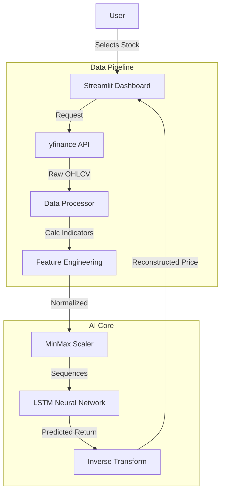

# 📘 AI-Powered Stock Forecasting System: The Complete Guide

> **Version:** Production Release
> **Author:** Admin
> **Date:** 2026

---

## 📖 Table of Contents
1.  [Executive Summary](#executive-summary)
2.  [System Architecture](#system-architecture)
3.  [Mathematical Foundation](#mathematical-foundation)
4.  [Deep Learning Model (LSTM)](#deep-learning-model-lstm)
5.  [Project Roadmap](#project-roadmap)

---

## 1. Executive Summary

This project is a **Production-Grade Time Series Forecasting System** designed to predict stock market movements with high accuracy. Unlike basic tutorials that predict "Price" (which fails at All-Time Highs), this system predicts **Stationary Returns**, allowing it to generalize to any stock, cryptocurrency, or forex pair globally.

**Key capabilities:**
*   **Universal Access:** Fetches real-time data for 50,000+ tickers via Yahoo Finance.
*   **On-Demand Training:** Users can train dedicated AI models for specific stocks instantly.
*   **Quant-Grade Logic:** Uses log-returns and stationary transformations to handle market volatility.

---

## 2. System Architecture

The system follows a modular **ETL (Extract, Transform, Load)** pipeline architecture.

### 🏗️ High-Level Diagram

### 🔄 Data Flow
1.  **Ingestion:** Real-time data fetched via `yfinance`.
2.  **Processing:** 
    *   Computes **RSI (14)**, **MACD**, **Bollinger Bands**, and **Volume MA**.
    *   Converts Price $\rightarrow$ **Daily Returns** (Stationary Target).
3.  **Training:** 
    *   Splits data chronologically (Time-Series Split).
    *   Trains LSTM on 80% data, validates on 20%.
4.  **Inference:**
    *   Predicts $T+1$ Return.
    *   Reconstructs Price: $P_{t+1} = P_t \times (1 + R_{pred})$.

---

## 3. Mathematical Foundation

### 📉 The "Stationarity" Problem
Stock prices are **Non-Stationary** (mean and variance change over time).
*   *Issue:* An AI trained on 2010 prices ($100) cannot predict 2024 prices ($2000).
*   *Solution:* We predict **Returns** ($R_t$), which are stationary.

**Equation 1: Return Calculation**
$$ R_t = \frac{P_t - P_{t-1}}{P_{t-1}} $$

**Equation 2: Reconstruction**
$$ P_{pred} = P_{last} \times (1 + R_{pred}) $$

### 📊 Technical Indicators
The model inputs a 7-dimensional tensor including:
1.  **Relative Strength Index (RSI):** Momentum oscillator (0-100).
2.  **MACD:** Trend-following momentum indicator.
3.  **Bollinger Bands:** Volatility measurement.
4.  **Volume Moving Average:** Liquidity confirmator.

---

## 4. Deep Learning Model (LSTM)

We use a **Long Short-Term Memory (LSTM)** network, a type of Recurrent Neural Network (RNN) designed for sequence data.

### 🧠 Network Topology
*   **Input Layer:** `(Batch_Size, 60, 7)`
    *   Lookback: 60 Days
    *   Features: 7 (Returns, Volatility, Momentum, etc.)
*   **LSTM Layer 1:** 50 Neurons, `return_sequences=True`
    *   Extracts sequential patterns.
*   **Dropout Layer 1:** 20% Drop rate
    *   Prevents overfitting.
*   **LSTM Layer 2:** 50 Neurons, `return_sequences=False`
    *   Compresses sequence into a feature vector.
*   **Dense Layer:** 25 Neurons (ReLU)
*   **Output Layer:** 1 Neuron (Linear)
    *   Predicts scalar Return value.

---

## 5. Project Roadmap

### phase 1: Core Foundation (Completed ✅)
- [x] LSTM Model Implementation
- [x] Streamlit Dashboard
- [x] Global Data Integration
- [x] On-Demand Training

### phase 2: Advanced Analytics (Planned 🚀)
- [ ] **Transformer Models:** Implement "Time-GPT" architecture for longer horizons.
- [ ] **Sentiment Analysis:** Scrape news/Twitter to gauge market sentiment.
- [ ] **Portfolio Optimization:** Suggest "Efficient Frontier" allocations.
- [ ] **Backtesting Engine:** Simulate trading strategies on historical data.

---

**(c) 2026 Admin. All Rights Reserved.**
